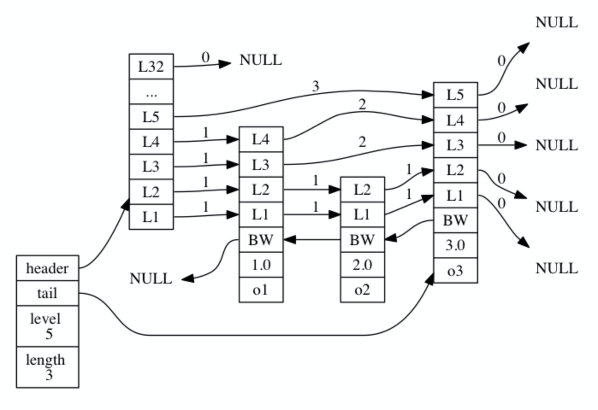
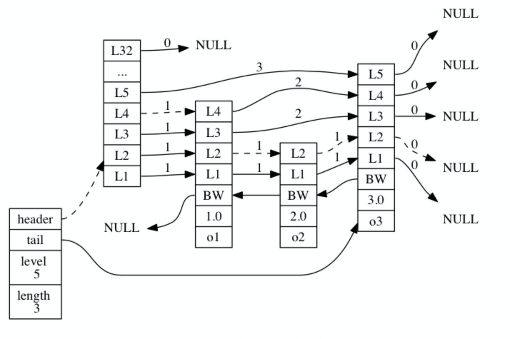
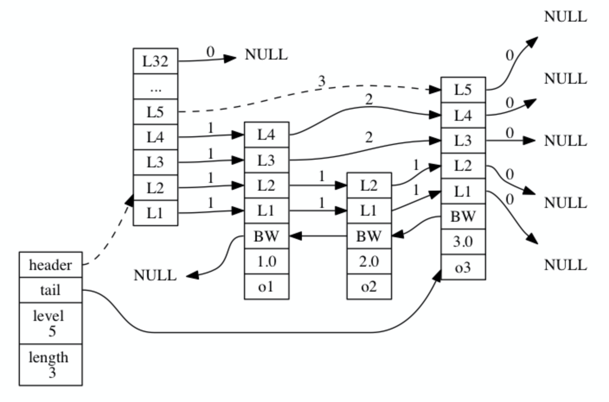
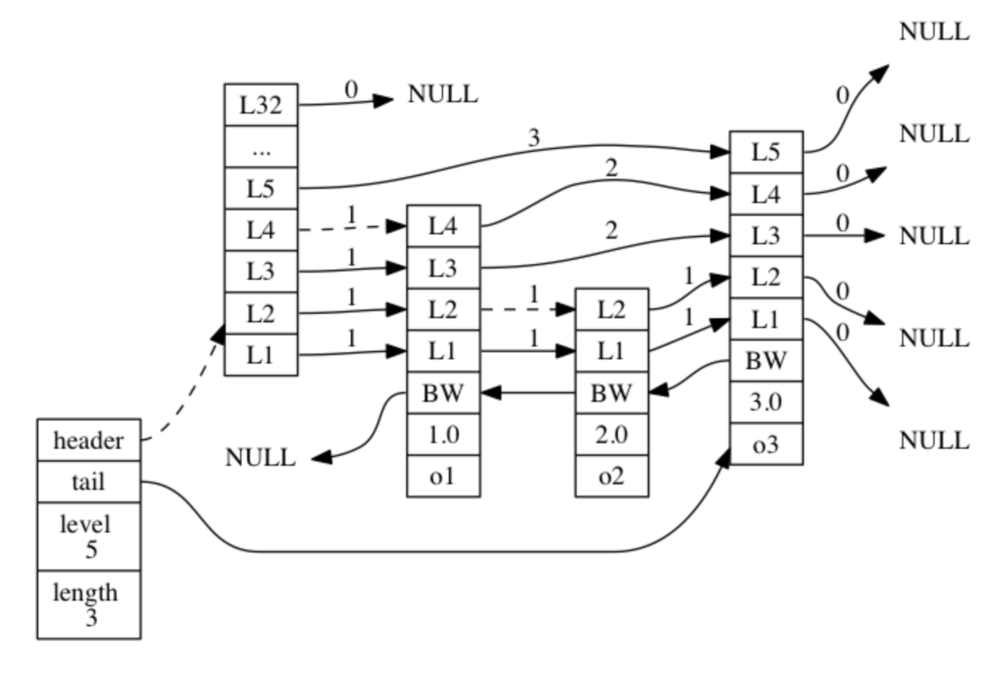

redis的zset底层实现是跳表，如下：


图片最左边的是zskiplist结构，该结构包含以下属性：
- header：指向跳跃表的表头节点。
- tail：指向跳跃表的表尾节点。
- level：记录目前跳跃表内，层数最大的那个节点的层数（表头节点的层数不计算在内）
- length：记录跳跃表的长度，也就是跳跃表目前包含节点的数量（表头节点不计算在内）

位于zskiplist结构右方的是四个zskiplistNode结构，该结构包含以下属性：
- 层（level）：节点中用L1、L2、L3等字样标记节点的各个层，L1代表第一层，L2代表第二层，以此类推。每个层都带有两个属性：前进指针和跨度。前进指针用于访问位于表尾方向的其他节点，而跨度则记录了前进指针所指向节点和当前节点的距离。在上面的图片中，连线上带有数字的箭头就代表前进指针，而那个数字就是跨度。当程序从表头向表尾进行遍历时，访问会沿着层的前进指针进行。
- 后退（backward）指针：节点中用BW字样标记节点的后退指针，它指向位于当前节点的前一个节点。后退指针在程序从表尾向表头遍历时使用。
- 分值（score）：各个节点中的1.0、2.0和3.0是节点所保存的分值。在跳跃表中，节点按各自所保存的分值从小到大排列。
- 成员对象（obj）：各个节点中的o1、o2和o3是节点所保存的成员对象。

注意表头节点（上图中4个zskiplistNode的第一个）和其他节点的构造是一样的：表头节点也有后退指针、分值和成员对象，不过表头节点的这些属性都不会被用到，所以图中省略了这些部分，只显示了表头节点的各个层。

跳表定义如下：
```c
typedef struct zskiplistNode { // 跳表中的节点
    // 后退指针
    struct zskiplistNode *backward;
    // 分值
    double score;
    // 成员对象
    robj *obj;
    // 层
    struct zskiplistLevel {
        // 前进指针
        struct zskiplistNode *forward;
        // 跨度
        unsigned int span;
    } level[];
} zskiplistNode;

typedef struct zskiplist { // 跳表
    // 表头节点和表尾节点
    struct zskiplistNode *header, *tail;
    // 表中节点的数量
    unsigned long length;
    // 表中层数最大的节点的层数
    int level;
} zskiplist;
```

下面来看跳表的一些属性：
#### 层
跳跃表节点的level数组可以包含多个元素，每个元素都包含一个指向其他节点的指针，程序可以通过这些层来加快访问其他节点的速度，一般来说，层的数量越多， 访问其他节点的速度就越快。每次创建一个新跳跃表节点的时候，程序都根据幂次定律（power law，越大的数出现的概率越小）随机生成一个介于1和32之间的值作为level数组的大小，这个大小就是层的“高度”。

#### 前进指针
每个层都有一个指向表尾方向的前进指针（level[i].forward 属性），用于从表头向表尾方向访问节点。
下图用虚线表示出了程序从表头向表尾方向，遍历跳跃表中所有节点的路径：
- 迭代程序首先访问跳跃表的第一个节点（表头），然后从第四层的前进指针移动到表中的第二个节点。
- 在第二个节点时，程序沿着第二层的前进指针移动到表中的第三个节点。
- 在第三个节点时，程序同样沿着第二层的前进指针移动到表中的第四个节点。
- 当程序再次沿着第四个节点的前进指针移动时，它碰到一个NULL ，程序知道这时已经到达了跳跃表的表尾，于是结束这次遍历。



#### 跨度
层的跨度（level[i].span属性）用于记录两个节点之间的距离：
- 两个节点之间的跨度越大，它们相距得就越远。
- 指向NULL的所有前进指针的跨度都为0 ，因为它们没有连向任何节点。
- 跨度和遍历操作无关，遍历操作只使用前进指针就可以完成了，跨度实际上是用来计算排位（rank）的：在查找某个节点的过程中，将沿途访问过的所有层的跨度累计起来，得到的结果就是目标节点在跳跃表中的排位。
如下图用虚线标记了在跳跃表中查找分值为3.0 、成员对象为o3的节点时，沿途经历的层：查找的过程只经过了一个层，并且层的跨度为3，所以目标节点在跳跃表中的排位为3。



另一个例子，虚线标记了在跳跃表中查找分值为2.0、成员对象为o2的节点时，沿途经历的层：在查找节点的过程中，程序经过了两个跨度为1的节点，因此可以计算出，目标节点在跳跃表中的排位为2。



#### 后退指针
节点的后退指针（backward属性）用于从表尾向表头方向访问节点：跟可以一次跳过多个节点的前进指针不同，因为每个节点只有一个后退指针，所以每次只能后退至前一个节点。

#### 分值和成员
节点的分值（score属性）是一个double类型的浮点数，跳跃表中的所有节点都按分值从小到大来排序。

节点的成员对象（obj属性）是一个指针，它指向一个字符串对象，而字符串对象则保存着一个SDS值。

在同一个跳跃表中，各个节点保存的成员对象必须是唯一的，但是多个节点保存的分值却可以是相同的：分值相同的节点将按照成员对象在字典序中的大小来进行排序，成员对象较小的节点会排在前面（靠近表头的方向），而成员对象较大的节点则会排在后面（靠近表尾的方向）。