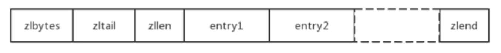
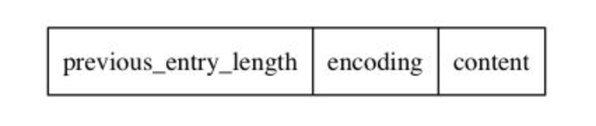

压缩列表（ziplist）是redis的列表和哈希的实现之一，当保存的对象是小整数值，或者是长度较短的字符串，那么redis就会使用压缩列表来作为列表的实现。同样对于哈希键，如果哈希键只包含少量键值对，并且每个键值对的键和值要么是小整数，或者是长度较短的字符串，那么redis就会使用压缩列表来作为哈希键的实现

ziplist是一系列特殊编码的连续内存块组成的顺序序列数据结构（类似数组），可以包含任意多个节点(entry)，每一个节点可以保存一个字节数组或者一个整数值，结构如下：

各字段含义如下：
- zlbytes：压缩列表的字节长度，占4个字节，因此压缩列表最长(2^32)-1字节；
- zltail：压缩列表尾元素相对于压缩列表起始地址的偏移量，占4个字节；
- zllen：压缩列表的元素数目，占两个字节；那么当压缩列表的元素数目超过(2^16)-1怎么处理呢？此时通过zllen字段无法获得压缩列表的元素数目，必须遍历整个压缩列表才能获取到元素数目；
- entryX：压缩列表存储的若干个元素，可以为字节数组或者整数；
- zlend：压缩列表的结尾，占一个字节，恒为0xFF。

每个压缩列表节点（entry）可以保存一个字节数组或者一个整数值，其中字节数组可以是以下三种长度的其中一种：
- 长度小于等于63（2^6-1）字节的字节数组；
- 长度小于等于16383（2^14-1）字节的字节数组；
- 长度小于等于4294967295（2^32-1）字节的字节数组；

而整数值则可以是以下六种长度的其中一种：
- 4位长，介于0至12之间的无符号整数；
- 1字节长的有符号整数；
- 3字节长的有符号整数；
- int16_t类型整数；
- int32_t类型整数；
- int64_t类型整数；

压缩列表节点的结构如下：

### previous_entry_length
节点的previous_entry_length属性以字节为单位，记录了压缩列表中前一个节点的长度。previous_entry_length长度为1字节或5字节：
- 如果前一字节的长度小于254字节，那么previous_entry_length的长度为1字节：前一节点的长度就保存在这一个节点中
- 如果前一字节的长度大于等于254字节，那么previous_entry_length的长度为5字节：其中属性的第一字节就会被设置为0xFE(十进制值254)，而之后的四个字节则用于保存前一节点长度。

有了previous_entry_length数组，ziplist就能够实现从表尾向表头遍历（因为内存地址是连续的，所以将当前entry的指针减去previous_entry_length就能将指针指向前一个entry）

### encoding
encoding记录了节点的content属性所保存数据的类型以及长度

### content
负责保存节点的值，节点的值可以是一个字节数组或者整数，值的类型和长度由节点的encoding属性决定。

### 连锁更新
考虑到一种特殊情况，ziplist中有多个连续的、长度在250~253字节的节点e1~eN，则所有节点的previous_entry_length属性都是1字节。此时，将一个大于254字节的节点插入到e1之前，则e1的previous_entry_length需要扩充到5字节。而这样会造成一个麻烦，此时由于e1增加了4个字节，导致其从250~253字节变成了254~257字节，则e2的previous_entry_length也需要扩充到5字节。这样的更新会一直连锁到eN为止。

上述情况称为连锁更新（cascadeupdate）。除了新增，删除节点也有可能导致连锁更新。连锁更新的最坏情况下对ziplist进行N次空间重分配，每次重分配最坏的复杂度是O(N)，所以连锁更新的时间复杂度是O(N2)。

虽然如此，但是由于多个连续节点长度都在250~253字节出现的情况很少，而部分连续节点的更新也不会耗很多时间，因而ziplist的效率仍然很高。